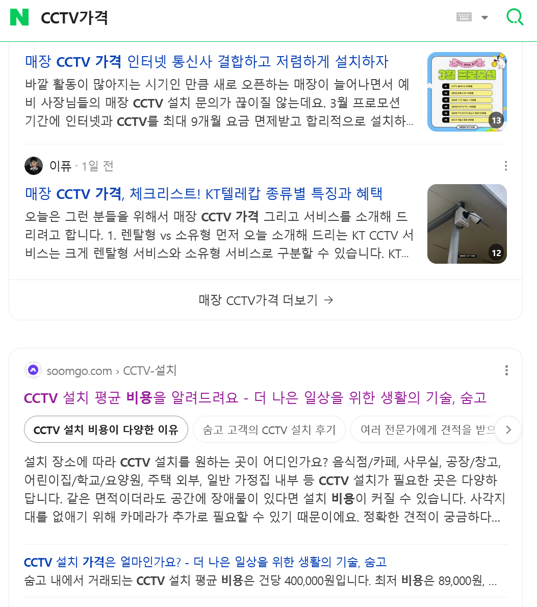

우린, 

'케어온'이라는

"자영업자를 위한 모든 것 "

이란 가치로 웹서비스를 만들고, 이 웹앱을 감싸서 안드로이드와 ios 앱으로도 만들거야 . 

그를 위해 

'숨고' 앱(+웹앱) 의 마케팅 전략을 벤치마킹 할거야. 

우리의 시작점은 

CCTV설치를 하고자 하는 고객의 유입을 SEO를 통해서 가져오는 것이고

이를 이미 효과적인 방법으로 해낸

숨고 앱의 전략을 그대로 역설계할거야. 

숨고는, 

네이버와 구글에서 

'CCTV 설치 평균 비용을 알려드려요' 라는 제목의 웹문서를 (NEXTJS안의 

app/prices/CCTV-%EC%84%A4%EC%B9%98 )

(위치:00_DEV\reference\숨고\CCTV 설치 평균 비용을 알려드려요.htm

, 다운폴더 : 00_DEV\reference\숨고\CCTV 설치 평균 비용을 알려드려요_files)

통해 (7580번째 줄 부터 seo를 한 텍스트인듯)

최적화를 한 웹페이지로 고객을 유인하고 

거기서 버튼을 클릭하면 바로 신청폼 페이지로 넘어간거같아. 

이걸 벤치마킹하려고해 

(위치:00_DEV\reference\숨고\cctv신청폼.htm)

(다운 폴더 : 00_DEV\reference\숨고\cctv신청폼_files)
